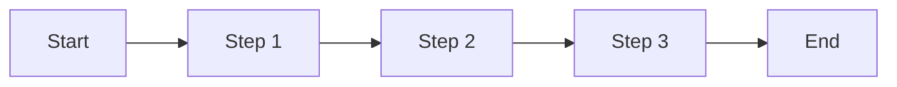
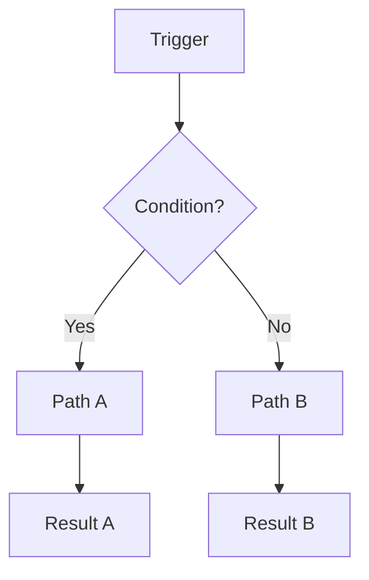
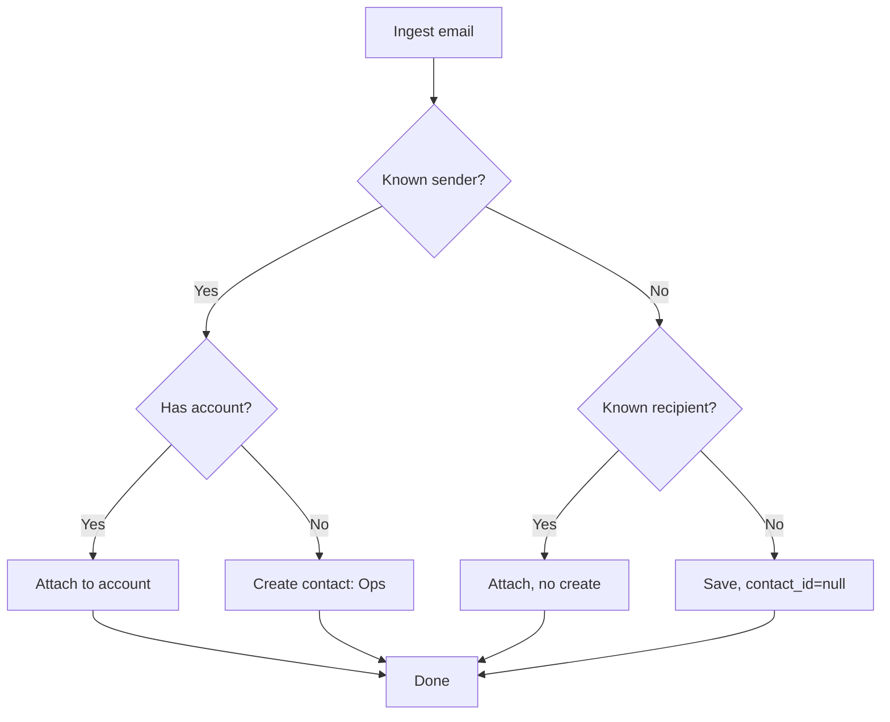
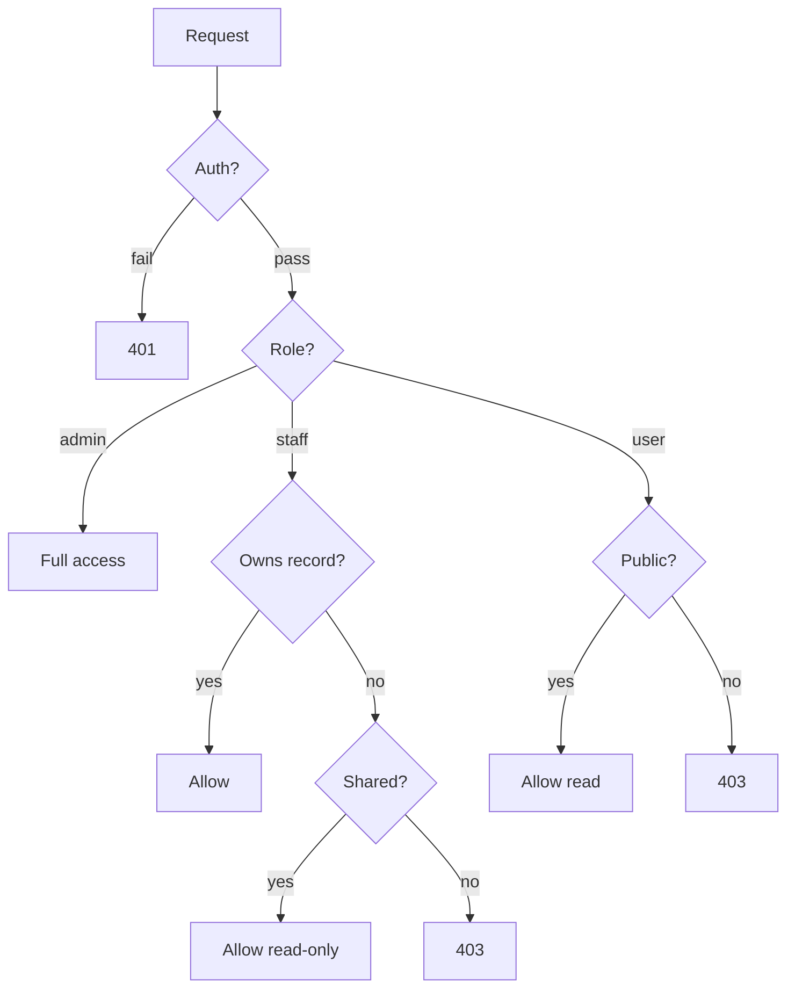

# Overview #

This file demonstrates every feature supported by the MD → HTML converter.
Use it as a starting point for documentation, skill write-ups, or internal guides.

Jump links are generated automatically from every `# Section #` heading.
Sub-sections use `## Header ##` and render as contained cards.
Scroll down or click the jump links above to explore.

---

# Sections & Headers #

## What the syntax does ##

| Syntax | Renders as |
|---|---|
| `# Title #` | Page section with jump link in the nav bar |
| `## Header ##` | Contained card / sub-section |
| `### Sub-header` | Smaller heading inside content |
| `#### Detail` | Lowest-level label |

Use closing `#` on h1 and h2 to signal intent to the converter — they are stripped from rendered output.

## Nesting example ##

### Step one

Describe the first step here. Keep it tight — one idea per paragraph.

### Step two

Follow-up content. The `###` and `####` levels are plain headings, not cards.

---

# Callouts #

## Note ##

> [!NOTE] Note
> Use this for context or background that the reader should know but that is not urgent.

## Tip ##

> [!TIP] Pro Tip
> Highlight a shortcut, trick, or best practice. Gentle positive framing.

## Warning ##

> [!WARNING] Watch out
> Flag something that could go wrong if the reader skips this step.

## Danger ##

> [!DANGER] Do not do this
> Reserved for irreversible or destructive actions. Use sparingly — overuse dilutes impact.

## Success ##

> [!SUCCESS] Done
> Confirm a completed state, a passing check, or a positive outcome.

---

# Tables #

## Basic table ##

| Field | Type | Required | Notes |
|---|---|---|---|
| `name` | string | yes | Unique per scope |
| `email` | string | yes | Validated on create |
| `role_scope` | enum | yes | `User` / `Ops` / `Partner` / `Staff` |
| `stage` | string | no | Defaults to account stage |

## Alignment ##

| Left | Center | Right |
|:---|:---:|---:|
| Apple | 42 | $1.00 |
| Banana | 7 | $0.25 |

---

# Flowcharts #

## Linear flow ##



## Two-level branching ##



## Three-level branching ##



## Four-level branching ##



---

# Skill Optimization Guide #

## What this is ##

KCS/OS shells load skills at session start. Long, verbose skill bodies consume tokens on every session. This guide shows how to convert a human-readable skill into a compact, optimized form that retains all instruction while cutting token weight.

> [!NOTE] When to optimize
> Optimize a skill when it is used frequently (assigned to multiple shells) or when it contains prose explanations the AI does not need — it already understands context from the system prompt.

## The optimization rules ##

| Rule | Verbose | Optimized |
|---|---|---|
| Cut preamble | "This skill helps you do X by..." | _(delete)_ |
| Strip "you should" | "You should always validate..." | "Validate…" |
| Remove tautologies | "Make sure to check that the value exists before using it" | "Null-check before use" |
| Collapse lists | Full-sentence bullets | Noun-phrase or keyword bullets |
| Drop examples when pattern is obvious | Inline examples of common patterns | _(delete or move to a separate reference skill)_ |
| Use MD tables for structured data | Prose explaining fields | Table: field / type / notes |
| Anchor rules explicitly | Scattered prose guidance | `RULE:` prefix on decision-critical lines |

## Before and after example ##

### Before (verbose, ~200 tokens)

This skill is used when you need to draft a reply email to a contact. You should always start by looking up the contact's account to understand the relationship context. Then review any recent meeting notes or summaries for that account. After gathering context, draft the reply in a professional but warm tone. Make sure to avoid using jargon the recipient may not understand. The subject line should match the thread. Always end with a clear next step or ask.

### After (optimized, ~60 tokens)

Draft reply emails to contacts.

**Steps:**
1. Fetch contact → account (relationship context)
2. Check recent meeting notes / summary
3. Draft: professional, warm, jargon-free
4. Subject: match thread
5. Close: explicit next step or ask

> [!TIP] Token math
> A skill assigned to 4 shells fires 4 times per session start. 140 tokens saved = 560 tokens saved per session open. Across 30 sessions per day that is ~16,800 tokens/day per skill.

## Skill MD structure ##

The converter reads skills stored as plain Markdown. Use this structure:

```
# Skill Name #

One-line purpose statement.

## When to use ##

Bullet list of trigger conditions.

## Steps ##

Numbered steps. Short. Imperative mood.

## Rules ##

RULE: Critical constraint — no exceptions.
RULE: Another hard boundary.

## Output format ##

What the skill produces: format, length, fields.
```

> [!WARNING] Do not add
> - Introductory prose about why the skill exists
> - Conversational examples ("for instance, if a user asks...")
> - Redundant restatements of the system prompt
> - Trailing notes about edge cases that never occur

## Checklist before saving ##

| Check | Pass condition |
|---|---|
| Purpose line | ≤ 15 words, imperative, no "This skill..." |
| Steps | All imperative, ≤ 10 words each |
| Rules | Lead with `RULE:`, cover only hard constraints |
| Tables used | Anywhere you have 3+ structured fields |
| Total body | ≤ 300 tokens for a single-purpose skill |

---

# Quick Reference #

## All supported syntax at a glance ##

```
# Section Title #          → jump-link section
## Sub-section Title ##    → card / sub-section
### H3 heading             → plain heading
#### H4 heading            → smaller heading

> [!NOTE] Title            → note callout
> body text

> [!TIP] Title             → tip callout
> [!WARNING] Title         → warning callout
> [!DANGER] Title          → danger callout
> [!SUCCESS] Title         → success callout

| Col | Col |              → table
|---|---|
| val | val |


**bold**   _italic_   `inline code`
[link text](url)
- unordered list
1. ordered list
```

> [!SUCCESS] You're ready
> This template covers the full feature set. Copy it, delete what you don't need, and write.
